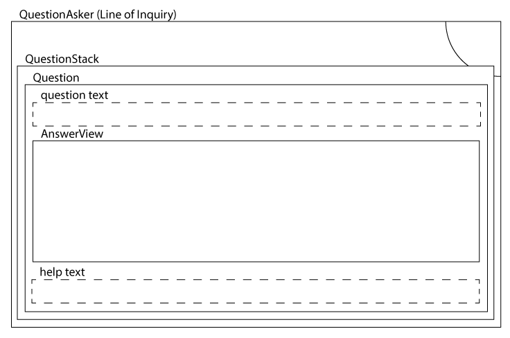

Nested View Style
=================

Uses a bunch of thin layers to help stay DRY. Doesn't use bound fields, but instead creates and destroys views when it needs to do major updates to the UI. This is the backbone-y way, afaict.

To make it work, we treat each box on the survey as a line of inquiry (called in the code QuestionAsker). It can ask any number of Questions to collect the data it needs.

Underlying the this concept is the fact that boxes on the page that we now call questions are actually many to many maps between data collected on the one hand, and questions we pose to get there on the other. The QuestionAsker is the interface between the two.

Layers
------

